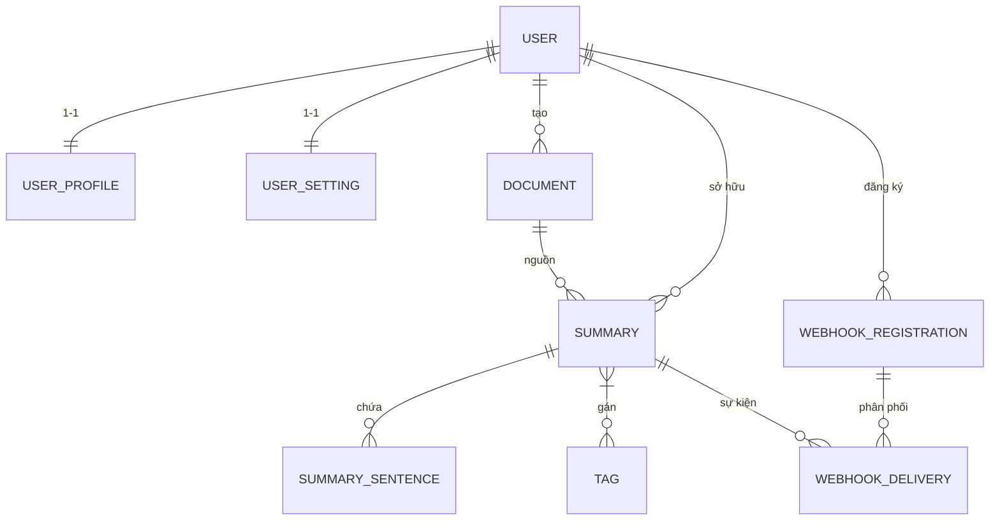

# Kiến trúc SummarEase

## Phạm vi

SummarEase là ứng dụng Django 5.2 dạng MVT, gồm giao diện server-rendered và JavaScript/CSS tĩnh. Đây là dự án demo/học tập: cấu hình mặc định dùng SQLite, không cần Redis hay Gemini. TextRank chạy trong ứng dụng; Gemini là tích hợp tùy chọn, gọi dịch vụ Google khi người dùng chọn và đã có khóa.

## Thành phần

| Thành phần | Vai trò |
|---|---|
| Django `backend/config/` | Settings, URL routing, WSGI/ASGI, middleware bảo mật, request ID và logging |
| Django app `backend/summaries/` | Tài khoản, biểu mẫu, tóm tắt, lịch sử, chia sẻ, webhook, xuất tệp và API |
| NLP và trích xuất | TextRank nội bộ; Gemini tùy chọn; đọc TXT/Markdown, PDF, DOCX, EPUB và nội dung URL |
| Giao diện `frontend/` | Django templates, CSS và JavaScript thuần; không cần frontend build tool |
| SQLite / MySQL / PostgreSQL / SQL Server | SQLite mặc định cho local/test; CI kiểm tra MySQL và PostgreSQL |
| Celery + Redis | Tác vụ nền trong chế độ production khi cấu hình broker; không bắt buộc cho demo local |
| Docker Compose | Web, Redis, Celery worker và Celery Beat; database production được cung cấp bên ngoài |
| GitHub Actions | Ruff, mypy, bảo mật dependencies, test Python, tích hợp database, E2E và Docker build |

## Luồng tạo bản tóm tắt

```text
Trình duyệt
  │ POST (session + CSRF)
  ▼
Django view ──► SummaryRequestForm / SummaryService
  │ kiểm tra quyền, loại nguồn, kích thước và giới hạn request
  ▼
Text / URL / file
  │ URL được kiểm tra SSRF; file được kiểm tra phần mở rộng/kích thước
  ▼
Bộ trích xuất nội dung ──► TextRank nội bộ hoặc Gemini tùy chọn
  ▼
Database: Document + Summary (+ câu/tag liên quan)
  │
  ├── DEBUG/test: xử lý đồng bộ
  └── production có Redis: Celery task và trả task ID
  ▼
Giao diện hiển thị kết quả / lịch sử / chia sẻ / xuất Markdown-DOCX-PDF
```

Các file tải lên được giới hạn 10 MB. URL ngoài có kiểm tra địa chỉ đích và redirect, timeout và giới hạn response; đây là biện pháp giảm rủi ro SSRF, không thay thế egress firewall khi triển khai công khai.

## Tác vụ nền và webhook

Trong cấu hình production của Docker Compose, web, worker và Beat dùng chung database ngoài và Redis nội bộ. Tác vụ tóm tắt được đưa vào Celery. Nếu Redis chưa sẵn sàng hoặc lỗi, ứng dụng trả lỗi dịch vụ nền thay vì giả vờ đã tạo tác vụ.

Khi bản tóm tắt phát sinh sự kiện webhook, bản ghi outbox được ghi trong database cùng transaction; sau commit, ứng dụng enqueue delivery. Beat quét các delivery đang chờ mỗi phút để khôi phục tình huống enqueue thất bại hoặc worker gián đoạn. Retry có giới hạn và dùng header `X-Webhook-Delivery` ổn định để bên nhận khử trùng lặp. Mô hình giao nhận là **at-least-once**, không bảo đảm exactly-once qua HTTP. Redis/Celery/Beat chỉ cần khi bật luồng production này.

## Dữ liệu và cấu hình

- Django migrations là nguồn chuẩn để tạo/cập nhật schema.
- SQLite mặc định lưu tại `backend/sql/db.sqlite3`; có thể đổi bằng `SQLITE_DB_PATH`.
- Cấu hình MySQL/PostgreSQL/SQL Server đặt qua `DB_ENGINE` và các biến `DB_*` trong `backend/.env`.
- `DB_ENGINE=postgres` là tuỳ chọn và là backend duy nhất bật full-text search thật
  (`SearchVectorField` + `SearchVector` trong signal). Kiểu trường được quyết định từ
  setting `USE_POSTGRES_SEARCH`, không đọc `connection.vendor` lúc import. Trên các
  backend còn lại, tìm kiếm rơi về `icontains` trên `title`/`summary_text`.
  CI chạy migration check, webhook security tests và benchmark TextRank trên PostgreSQL.
- Docker Compose production yêu cầu database bên ngoài (MySQL, PostgreSQL hoặc SQL Server); SQLite không phù hợp với nhiều tiến trình web/worker trong cấu hình đó.
- `backend/.env.example` chứa cấu hình mẫu; file `backend/.env`, khóa thật, media và chứng chỉ local không được commit.
- Khóa Gemini có thể cấu hình ở cấp hệ thống hoặc người dùng. Khóa người dùng được mã hóa trong database; nội dung đưa vào Gemini được gửi tới Google.
- Không có tài khoản tạo sẵn. `python manage.py setup` chạy migrations; dùng giao diện để đăng ký hoặc `createsuperuser` cho quản trị.

## Mô hình dữ liệu (ERD & Từ điển)

### Sơ đồ thực thể - liên kết (Mermaid ERD)



### Từ điển dữ liệu

| Bảng (Model) | Cột (Field) | Kiểu | Ràng buộc / Ghi chú |
|---|---|---|---|
| `User` (Django auth) | `id` | `AutoField` | PK |
| | `username` | `CharField(150)` | Unique, required |
| | `email` | `EmailField` | Optional |
| | `password` | `CharField(128)` | Hashed |
| | `is_superuser` | `BooleanField` | Default False |
| | `date_joined` | `DateTimeField` | Auto_now_add |
| `UserProfile` | `id` | `AutoField` | PK |
| | `user` | `OneToOneField(User)` | Unique, FK, related_name=`profile` |
| | `role` | `CharField(20)` | Choices: `admin`, `user`; default `user` |
| `UserSetting` | `id` | `AutoField` | PK |
| | `user` | `OneToOneField(User)` | Unique, FK, related_name=`setting` |
| | `default_summary_ratio` | `FloatField` | Default 0.2, min 0.0, max 1.0 |
| | `language_preference` | `CharField(20)` | Default `auto` |
| | `gemini_api_key` | `CharField(255)` | Blank, encrypted at rest |
| `Document` | `id` | `AutoField` | PK |
| | `user` | `ForeignKey(User)` | FK, related_name=`documents`, db_index |
| | `source_type` | `CharField(20)` | Choices: `text`, `file`, `url`; db_index |
| | `title` | `CharField(255)` | Required |
| | `source_name` | `CharField(255)` | Blank (URL hoặc tên file gốc) |
| | `uploaded_file` | `CharField(500)` | Blank (đường dẫn file upload) |
| | `content` | `TextField` | Nội dung văn bản gốc |
| | `created_at` | `DateTimeField` | Auto_now_add, index `(user, -created_at)` |
| `Summary` | `id` | `AutoField` | PK |
| | `document` | `ForeignKey(Document)` | FK, related_name=`summaries` |
| | `user` | `ForeignKey(User)` | FK, related_name=`summaries` |
| | `title` | `CharField(255)` | Required |
| | `method` | `CharField(20)` | Choices: `textrank`, `gemini` |
| | `language` | `CharField(20)` | Default `auto` |
| | `ratio` | `FloatField` | Default 0.2 |
| | `summary_text` | `TextField` | Nội dung tóm tắt |
| | `created_at` | `DateTimeField` | Auto_now_add |
| | `tags` | `ManyToManyField(Tag)` | Blank, related_name=`summaries` |
| | `search_vector` | `SearchVectorField` \| `TextField` | PG: SearchVectorField; khác: TextField; nullable |
| `SummarySentence` | `id` | `AutoField` | PK |
| | `summary` | `ForeignKey(Summary)` | FK, related_name=`sentences`, db_index |
| | `sentence_text` | `TextField` | Câu gốc được chọn |
| | `sentence_index` | `PositiveIntegerField` | Default 0, ordering |
| `Tag` | `id` | `AutoField` | PK |
| | `name` | `CharField(100)` | Unique |
| | `slug` | `SlugField(120)` | Unique, auto từ name |
| | `description` | `CharField(255)` | Blank |
| `WebhookRegistration` | `id` | `AutoField` | PK |
| | `user` | `ForeignKey(User)` | FK, related_name=`webhooks` |
| | `url` | `URLField` | Validated (public HTTPS, no creds, no private IP) |
| | `secret` | `CharField(64)` | HMAC key, auto-generated |
| | `events` | `JSONField` | List[str] (e.g. `["summary.completed"]`) |
| | `is_active` | `BooleanField` | Default True; auto-disabled after 10 failures |
| | `created_at` | `DateTimeField` | Auto_now_add |
| | `updated_at` | `DateTimeField` | Auto_now |
| | `last_triggered` | `DateTimeField` | Nullable |
| | `failure_count` | `PositiveSmallIntegerField` | Default 0 |
| `WebhookDelivery` | `id` | `AutoField` | PK |
| | `webhook` | `ForeignKey(WebhookRegistration)` | FK, related_name=`deliveries` |
| | `summary` | `ForeignKey(Summary)` | FK, related_name=`webhook_deliveries` |
| | `event` | `CharField(64)` | e.g. `summary.completed` |
| | `status` | `CharField(12)` | Choices: `pending`, `processing`, `delivered`, `failed` |
| | `attempt_count` | `PositiveSmallIntegerField` | Default 0 |
| | `available_at` | `DateTimeField` | Default now |
| | `locked_at` | `DateTimeField` | Nullable |
| | `delivered_at` | `DateTimeField` | Nullable |
| | `created_at` | `DateTimeField` | Auto_now_add |
| | **Unique constraint** | | `(webhook, summary, event)` |

---

## Sơ đồ thư mục rút gọn

```text
SummarEase-Django/
├── backend/
│   ├── config/                 # Settings, URLs, WSGI/ASGI, middleware
│   ├── summaries/              # Django app, API, NLP, tasks, migrations
│   │   └── test_*.py           # Kiểm thử backend, tách theo domain
│   ├── api-tests/              # Request HTTP mẫu để thử API thủ công
│   ├── sql/                    # SQLite mặc định và schema SQL Server tham khảo
│   ├── .env.example            # Mẫu cấu hình
│   └── conftest.py             # Cấu hình pytest
├── frontend/
│   ├── templates/              # Giao diện Django
│   ├── static/                 # CSS và JavaScript
│   └── e2e/                    # Kiểm thử Playwright
├── scripts/                    # Script chạy HTTPS/dev trên Windows
├── loadtest/                   # Locust, tải kiểm thử và benchmark
├── monitoring/                 # Dashboard Grafana
├── docs/                       # Tài liệu hướng dẫn
├── Dockerfile
├── docker-compose.yml
├── manage.py
├── requirements.txt
└── requirements-dev.txt
```

### Kiểm thử backend theo domain

| Module | Phạm vi |
|---|---|
| `test_nlp.py` | TextRank, tách câu, chuẩn hoá, dò ngôn ngữ, từ khoá, sinh tiêu đề |
| `test_models.py` | Field, index, chuỗi hiển thị, dọn file, tìm kiếm |
| `test_auth.py` | Đăng nhập/đăng ký, đặt lại mật khẩu, giới hạn truy cập, cài đặt, ký số |
| `test_flows.py` | Tạo tóm tắt, phân trang lịch sử, phân quyền, xuất tệp, chia sẻ, trạng thái tác vụ |
| `test_inputs.py` | Biểu mẫu, URL, chống SSRF, tải tệp lên, trích xuất TXT/PDF/DOCX/EPUB |
| `test_batch.py` | Tóm tắt theo lô: ZIP (path traversal, giới hạn số lượng/kích thước, lỗi từng tệp) và URL |
| `test_gemini.py` | Tích hợp Gemini: nhánh thành công, lỗi, retry và prompt |
| `test_pages.py` | Trang admin, trang lỗi, security header, trang chia sẻ, health, OpenAPI |
| `test_webhooks.py` | Validate URL, ký HMAC, gửi HTTP có retry, vô hiệu hoá sau 10 lỗi, outbox + `on_commit`, view tạo/xoá/test |
| `test_ops.py` | System check, URL map, cấu hình deploy, sao lưu/khôi phục, metrics, rate limit |

Thư mục `media/`, chứng chỉ tự ký và SQLite local có thể được tạo khi chạy, không phải mã nguồn cần commit.

## Điểm vào quan trọng

| Điểm vào | Chức năng |
|---|---|
| `manage.py` | Lệnh quản trị Django |
| `backend/config/settings.py` | Cấu hình môi trường, database, cache/Celery và bảo mật |
| `backend/config/urls.py` | Nối giao diện, admin, API v1, schema, docs và metrics |
| `backend/summaries/urls.py` | Route trang, tóm tắt, lịch sử, webhook và health |
| `backend/summaries/services.py` | Kiểm tra đầu vào và điều phối việc tạo tóm tắt |
| `backend/summaries/readers.py` | Trích xuất tài liệu/URL và kiểm tra URL |
| `backend/summaries/nlp.py` | TextRank và tích hợp Gemini |
| `backend/summaries/tasks.py` | Tác vụ Celery và phục hồi webhook outbox |
| `frontend/static/js/app.js` | Tương tác form, kiểm tra UX và hiển thị kết quả |
| `scripts/run-dev.ps1` | Chạy Daphne HTTPS local trên Windows |
| `docker-compose.yml` | Web production mẫu, Redis, Celery worker và Beat |

## Công nghệ và kiểm tra

- Python 3.10–3.13, Django 5.2.
- HTML, CSS, JavaScript thuần; WhiteNoise phục vụ static files.
- TextRank nội bộ; Gemini API tùy chọn.
- SQLite local; MySQL/PostgreSQL/SQL Server tùy cấu hình; CI kiểm tra MySQL và PostgreSQL.
- Playwright/Chromium cho E2E; pytest cho backend.
- Kiểm tra tĩnh: `ruff check` + `ruff format --check` và `mypy` (cấu hình tập trung trong
  `pyproject.toml`; mypy bỏ qua bốn mã lỗi là giới hạn khi chưa dùng `django-stubs`).
- GitHub Actions kiểm tra test nhiều phiên bản Python, MySQL, PostgreSQL, lint/type/security, E2E và Docker build.

Các lệnh kiểm thử và hướng dẫn chạy ứng dụng nằm trong [README](../README.md) và [hướng dẫn sử dụng](help.md). Quy trình triển khai chi tiết hơn ở [production runbook](production.md).
